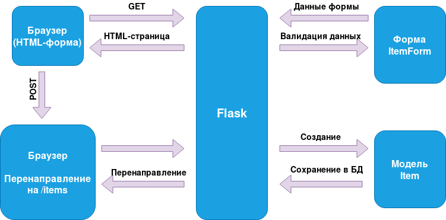
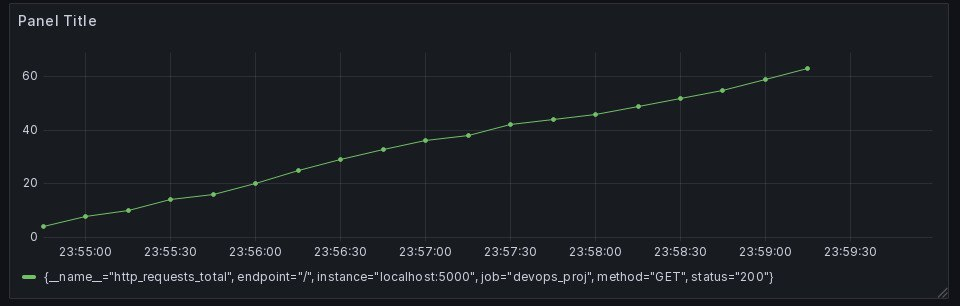
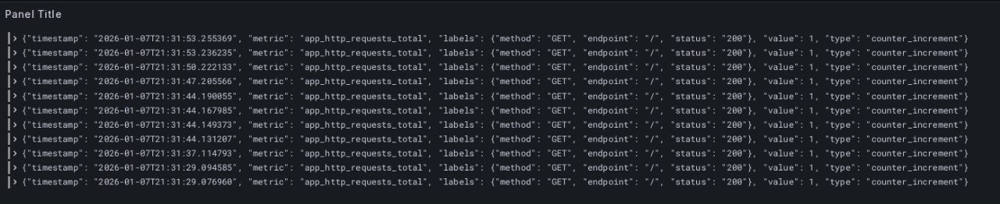
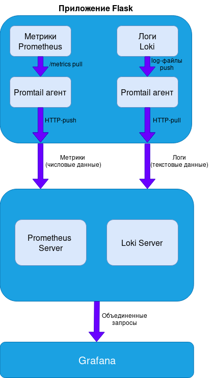

# Приложение для ведения повседневных заметок
## Вступление
Данное веб-приложение позиционирует себя как простейший способ ведения повседневных заметок. Приложение разработано на **Python 3.11** с использованием библиотеки **Flask** И **PostgreSQL**. База данных в данном веб-приложении используется для хранения информации о задачах.

## Структурная схема



## Описание структуры репозитория
В качестве корневой директории выступает **myapp**, где лежат все исходные файлы, разбитые по другим директориям. Ниже представлено описание содержимого корневой директории:

1. **init_db.py** - Инициализация базы данных. Отвечает за создание структуры таблиц в PostgreSQL. Если вызвать повторно, то структура будет пересоздана по новой, что приведет к утере имеющихся на момент пересоздания данных в базе данных.
2. **config.py** - Отвечает за базовую конфигурацию приложения. Каждый пользователь должен менять строки **SQLALCHEMY_DATABASE_URI** в соответствии с созданной им БД для развертывания приложения. _Возможно не придется, если у меня бд получится пихнуть в контейнер_.
3. **run.py** - Создает экземпляр Flask приложения и запускает встроенный сервер для разработки.
4. **requirements.txt** - Список библиотек, которые необходимо установить прежде чем начать использовать приложение. _В перспективе будут лежать в контейнере_.

### app
Основной пакет приложения
1. **init.py**
   * Отвечает за создание приложения через Flask
   * Создает структуры базы данных при запуске
   * Занимается инициализацией базы данных при запуске
2. **models.py**
   * Определяет структуры таблиц в PostgreSQL
   * Генерирует SQL-запросы
3. **routes.py**
   * Определяет URL-маршруты приложения
   * Обрабатывает HTTP-запросы (на текущий момент только GET и POST)
   * Работает с базой данных через модели
4. **forms.py**
   * Определяет структуры HTML-форм
   * Добавляет валидацию данных на стороне сервера
  
### templates
В данной директории хранятся HTML-шаблоны.

### tests
Здесь находятся тесты, проверяющие работоспособность приложения. Данные тесты встроены в CI для избегания ситуаций с кривыми коммитами в **main**.
1. **test_routes.py** - Симулирует HTTP-запросы к приложению тем самым проверяя работоспособность маршрутов.
2. **test_models.py** - Тестирует модели данных и их методы и проверяет валидацию и преобразование данных.

### static
Статические файлы. На данный момент здесь находится только один файл - **static.css**, который содержит внутри себя CSS стили.

## Добавление сбора метрик и логов с приложения
Сбор метрик осуществлялся с помощью **Prometheus** в связке с **Grafana**. Конфигурационный **.yml-файл** представлен в директории **config_examples**. Ниже будут приведены структурная схема, иллюстрирующая процесс сбора метрик и логов от приложения, а также скриншоты из Grafana, на которых будет виден результат сбора.



_Рис. 1 - График кол-ва успешных HTTP-запросов_



_Рис. 2 - Пример сбора логов с помощью Loki_

### Структурная схема



## Использование Docker

Приложение можно развернуть внутри контейнера, прилагая минимум собственных усилий. Первым делом для этого необходимо установить необходимые для работы с Docker пакеты:

```
sudo apt install docker.io
sudo usermod -aG docker $USER

sudo apt install docker-compose-v2
docker info
```

#### Разворачивание контейнера без логирования

Для того, чтобы развернуть контейнер без использования Prometheus, Grafana и т.д., требуется выполнить следующие команды из директории **DevOps**:

```
sudo docker build -t app .
sudo docker run -it --name app --network host app
```

После выполнения этих действий Вы будете перенесены внутрь контейнера. Оттуда достаточно просто запустить скрипт **install.sh**:

```
./install.sh
```

После установки всех необходимых программ и настройки БД с помощью данного скрипта, можно будет из директории **myapp** запустить приложение:

```
python3 run.py
```

Приложение будет доступно по адресу localhost:5000

### Использование Ansible

В директории **ansible** представлены следующие файлы:
1. **ansible.cfg** - содержит в себе начальную конфигурацию для Ansible
2. **inventory.ini** - по сути здесь просто необходимо указать IP компьютера, на котором развертывается приложение
3. **deploy.yml** - playbook, в котором указаны задачи, цель которых - подготовить окружение под приложение и проверить
его работоспособность.

Первым делом необходимо установить утилиты, которые позволят работать с Ansible

```
sudo apt-get install ansible
```

Ansible работает через SSH-соединение, поэтому для этого необходимо также установить свои утилиты

```
sudo apt-get install openssh-server
ssh-keygen
ssh-copy-id <hostname>
```

Где hostname результат выполнения команды

```
hostname
```

После этого переходим в директорию **ansible** и оттуда выполняем команду:

```
ansible-playbook -i inventory.ini deploy.yml --ask-become-pass
```


